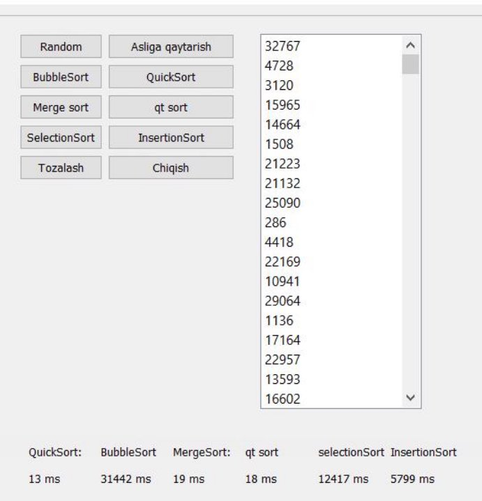

# qt-labaratoriya-sorting-algorithms

**Samarqand Davlat Universiteti Raqamli texnologiyalar fakulteti** 

203-guruh talabasi **Esanov** **Otabek**ning Dasturlash 

asoslari fanidan 

*Labaratoriya ishi*

**Mavzu**: Qt visual dasturlash muhitida saralash algoritmlari 

O‘qituvchi: Farxod Meliyev 

13.04.2021 

**Mavzu**: Qt visual dasturlash muhitida saralash algoritmlari Reja: 

1. Saralash algoritmlarning turlari. 
1. Qt muhitida saralash algoritmlari. 
1. Natija va tahlil. 
1. Xulosa. 
1. Foydalanilgan adabiyotlar. 

**Saralash algoritmlarining turlari** 

**Saralash** deb, berilgan obyektlar ketma-ketligini ma lum mantiqiy tartibda qayta joylashtirish jarayoniga aytiladi. Saralash bir necha ko rsatkichlarga bog liq bo lishi mumkin. Misol uchun maktab jismoniy tarbiya darsi. Bu dars boshida bolalar bo ylariga qarab  safda  turishadi.  Me yor  topshirish  jarayonida  esa  sinf  jurnalidagi  familyalar ketma-ketligiga qarab topshirishadi. Shu yerning o zida 2ta saralashdan foydalanilyapti. Biri, bo y uzunligi bo yicha, ikkinchisi sinf jurnalidagi o rinlar bo yicha. 

Saralash jarayoni qanday kechadi? Saralash jarayoni taqqoslashga asoslangan jarayon hisoblanadi.  Bu  jarayonni  his  qilish  uchun  miyamizdagi  tezlik  bilan  kechayotgan jarayonlarni birma-bir tahlil qilib chiqamiz(buning uchun saralanmagan sonlar ketma- ketligini olamiz): 

Sonlar berilishi: 23, 54, 3, 22, 1, 45; 

1. Eng kattasini boshiga o tkazamiz: 23, 3, 22, 1, 45, 54;(54 soni har bir son bilan solishtirilib eng katta ekani aniqlandi, 45 esa o z o rnida turibdi) 
1. Shu tartibni davom ettiramiz: 3, 22, 1, 23, 45, 54;(23 undan keyinda turuvchi eng katta son) 
1. Yuqoridagi amalni yana davom ettiramiz: 3, 1, 22, 23, 45, 54;(22 esa davomchi) 
4. Oxirgi marta almashtirishimiz quyidagi natijani beradi: 1, 3, 22, 23, 45, 54;(1 eng kichigi) 

Demak, miyamiz xuddi shu jarayonni takrorlar ekan. Endi bizga ma lumki, bizning miyamiz o zi optimal deb bilgan yo nalishdan ketadi va biz uchun faqat bitta saralash algoritmi mavjud. Ammo dasturlashda bunday deb bo lmaydi. Dasturlashga talab ortib, bu  soha  rivojlanib  borgani  sari  unda  bir  qator  sohalardagi  kabi  tezlikni  oshirish muammosi paydo bo ladi. Chunki ilk kompyuter tizimlarida kompyuter tizimining 30% tezligi, operativ xotirasi saralashga sarflanar edi. Shu o rinda savol tug iladi, operatsion tizimlarda ham saralashdan foydalaniladimi? Albatta ha! Fikrimiz isbotini hozirda keng foydalaniladigan  Total  Commander  dasturi  isbotlaydi.  Unda  bir  necha  xil  saralash mavjud:  fayl  turi,  nomi,  o zgartirilgan  sanasi  va  o lchami.  Har  birini  o sish  yoki kamayish  tartibida  saralash  mumkin.  Ha  aytgancha,  hozirgi  tizimlar  30%  emas anchagina kamroq tezlik va xotira sarflashadi. Chunki tezlik masalasi tobora yuqori cho qqiga chiqayotgan va ishlanayotgan ma lumotlar o lchami oshib borayotgan bir paytda sekin ishlovchi algoritmlardan foydalanish kulguli. Ma lumotlar o lchamlari esa juda katta, shu sabali ularni aniq va tez saralashga ehtiyoj mavjud. Buni amalga oshirish uchun esa yangi algoritmlarga ehtiyoj tug ila boshladi. Buni yechimi sifatida bir necha turdagi algoritmlardan foydalaniladi. Ular: 

1. Bubble sort; 
1. Selection sort; 
1. Insertion sort; 
1. Quick sort; 
1. Merge sort. 

**Qt muhitida saralash algoritmlari.** Biz dasturimizda 6 ta saralash usulidan foydalanamiz: 

Bular yuqorida ko’rsatilgan turlar va Qt muhitining standart qsort funksiyasidan. 

**1-ish.** Saralash algorimlarimizni bitta methodlar to’plamiga ega “algoritmlar.h” kutubxonasiga yozib olamiz. 

#ifndef ALGORITMLAR #define ALGORITMLAR #include <bits/stdc++.h> 

//almashtirish funksiyasi void swap(int \*xp, int \*yp) { 

`    `int temp = \*xp; 

`    `\*xp = \*yp; 

`    `\*yp = temp; 

} 

//quickSort - tez saralash algoritmi 

void quickSort(int \*arr, int low, int high) { 

`    `int i = low; 

`    `int j = high; 

`    `int pivot = arr[(i + j) / 2]; 

`    `int temp; 

`    `while (i <= j) 

`    `{ 

`        `while (arr[i] < pivot)             i++; 

`        `while (arr[j] > pivot)             j--; 

`        `if (i <= j) 

`        `{ 

`            `temp = arr[i]; 

`            `arr[i] = arr[j]; 

`            `arr[j] = temp; 

`            `i++; 

`            `j--; 

`        `} 

`    `} 

`    `if (j > low) 

`        `quickSort(arr, low, j);     if (i < high) 

`        `quickSort(arr, i, high); } 

// bubbleSort - pufakchali saralash algoritmi void bubbleSort(int arr[], int n) 

{ 

`    `int i, j; 

`    `for (i = 0; i < n-1; i++) 

`    `for (j = 0; j < n-i-1; j++) 

`        `if (arr[j] > arr[j+1]) 

`            `swap(&arr[j], &arr[j+1]); 

} 

// merge - mergeSort algoritmini qism dasturi void merge(int arr[], int l, int m, int r) 

{ 

`    `int n1 = m - l + 1; 

`    `int n2 = r - m; 

int L[n1], R[n2]; 

`    `for (int i = 0; i < n1; i++)         L[i] = arr[l + i]; 

`    `for (int j = 0; j < n2; j++)         R[j] = arr[m + 1 + j]; 

int i = 0; int j = 0; int k = l; 

`    `while (i < n1 && j < n2) {         if (L[i] <= R[j]) { 

`            `arr[k] = L[i]; 

`            `i++; 

`        `} 

`        `else { 

`            `arr[k] = R[j]; 

`            `j++; 

`        `} 

`        `k++; 

`    `} 

`    `while (i < n1) {         arr[k] = L[i];         i++; 

`        `k++; 

`    `} 

`    `while (j < n2) {         arr[k] = R[j];         j++; 

`        `k++; 

`    `} 

} 

// mergeSort - saralash algoritmi void mergeSort(int arr[],int l,int r){     if(l>=r){ 

`        `return; 

`    `} 

`    `int m =l+ (r-l)/2; 

`    `mergeSort(arr,l,m); 

`    `mergeSort(arr,m+1,r); 

`    `merge(arr,l,m,r); 

} 

// selectionSort - tanlash orqali saralash algoritmi void selectionSort(int arr[], int n) 

{ 

`    `int i, j, min\_idx; 

`    `for (i = 0; i < n-1; i++) 

`    `{ 

`        `min\_idx = i; 

`        `for (j = i+1; j < n; j++)         if (arr[j] < arr[min\_idx])             min\_idx = j; 

`        `swap(&arr[min\_idx], &arr[i]);     } 

} 

// insertionSort -  saralash algoritmi void insertionSort(int arr[], int n) { 

`    `int i, key, j; 

`    `for (i = 1; i < n; i++) 

`    `{ 

`        `key = arr[i]; 

`        `j = i - 1; 

`        `while (j >= 0 && arr[j] > key)         { 

`            `arr[j + 1] = arr[j]; 

`            `j = j - 1; 

`        `} 

`        `arr[j + 1] = key; 

`    `} 

} 

#endif // ALGORITMLAR 

**2-ish.** Dasturimizning asosiy qismini yozib olamiz: 

#include "mainwindow.h" #include "ui\_mainwindow.h" #include <QMessageBox> #include <algoritmlar.h> #include <QDateTime> #include <QtAlgorithms> using namespace std; 

int arr[100000],brr[100000]; 

MainWindow::MainWindow(QWidget \*parent) :     QMainWindow(parent), 

`    `ui(new Ui::MainWindow) 

{ 

`    `ui->setupUi(this); 

} 

MainWindow::~*MainWindow*() { 

`    `delete ui; 

} 

void MainWindow::on\_pushButton\_6\_clicked() 

{ 

`    `ui->listWidget->clear(); 

`    `for(int i=0;i<100000;i++){ 

`        `arr[i]=rand()%100000; 

`        `brr[i]=arr[i]; 

`        `ui->listWidget->addItem(QString::number(arr[i]));     } 

} 

void MainWindow::on\_pushButton\_4\_clicked() 

{ 

`    `QMessageBox msg; 

`    `msg.setWindowTitle("Tozalash"); 

`    `msg.setText("Sonlarni tozalashni xohlaysizmi?"); 

`    `msg.setStandardButtons(QMessageBox::Ok|QMessageBox::Cancel);     int ret=msg.*exec*(); 

switch(ret){ 

`        `case QMessageBox::Ok: 

`            `ui->listWidget->clear();             break; 

`        `default: 

`            `break; 

`    `} 

} 

void MainWindow::on\_pushButton\_5\_clicked() 

{ 

`    `QMessageBox msg; 

`    `msg.setWindowTitle("Chiqish"); 

`    `msg.setText("Dasturdan chiqishni xohlaysizmi?"); 

`    `msg.setStandardButtons(QMessageBox::Ok|QMessageBox::Cancel);     int ret=msg.*exec*(); 

`    `switch(ret){ 

`        `case QMessageBox::Ok:             this->close(); 

`            `break; 

`        `default: 

`            `break; 

`    `} 

} 

void MainWindow::on\_pushButton\_clicked() 

{ 

`    `QDateTime t\_start=QDateTime::currentDateTime(); 

`    `QDateTime t\_end; 

`    `quickSort(arr, 0, 100000); 

`    `t\_end=QDateTime::currentDateTime(); 

`    `ui->listWidget->clear(); 

`    `for(int i=0;i<100000;i++){ 

`        `ui->listWidget->addItem(QString::number(arr[i])); 

`    `} 

`    `qint64 ms = t\_start.msecsTo(t\_end); 

`    `ui->label\_4->setText(QString::number(ms)+" milliseconds"); } 

void MainWindow::on\_pushButton\_2\_clicked() 

{ 

`    `QDateTime t\_start=QDateTime::currentDateTime();     QDateTime t\_end; 

`    `bubbleSort(arr, 100000); 

`    `t\_end=QDateTime::currentDateTime(); 

`    `ui->listWidget->clear(); 

`    `for(int i=0;i<100000;i++){ 

`        `ui->listWidget->addItem(QString::number(arr[i]));     } 

`    `qint64 ms = t\_start.msecsTo(t\_end); 

`    `ui->label\_5->setText(QString::number(ms)+" milliseconds"); } 

void MainWindow::on\_pushButton\_3\_clicked() 

{ 

`    `QDateTime t\_start=QDateTime::currentDateTime();     QDateTime t\_end; 

`    `mergeSort(arr, 0, 100000); 

`    `t\_end=QDateTime::currentDateTime(); 

`    `ui->listWidget->clear(); 

`    `for(int i=0;i<100000;i++){ 

`        `ui->listWidget->addItem(QString::number(arr[i]));     } 

`    `qint64 ms = t\_start.msecsTo(t\_end); 

`    `ui->label\_6->setText(QString::number(ms)+" milliseconds"); } 

void MainWindow::on\_pushButton\_7\_clicked() 

{ 

`    `QDateTime t\_start=QDateTime::currentDateTime();     QDateTime t\_end; 

`    `qSort(arr,arr+100000); 

`    `t\_end=QDateTime::currentDateTime(); 

`    `ui->listWidget->clear(); 

`    `for(int i=0;i<100000;i++){ 

`        `ui->listWidget->addItem(QString::number(arr[i]));     } 

`    `qint64 ms = t\_start.msecsTo(t\_end); 

`    `ui->label\_8->setText(QString::number(ms)+" milliseconds"); } 

void MainWindow::on\_pushButton\_8\_clicked() 

{ 

`    `QDateTime t\_start=QDateTime::currentDateTime();     QDateTime t\_end; 

`    `selectionSort(arr,100000); 

`    `t\_end=QDateTime::currentDateTime(); 

`    `ui->listWidget->clear(); 

`    `for(int i=0;i<100000;i++){ 

`        `ui->listWidget->addItem(QString::number(arr[i]));     } 

qint64 ms = t\_start.msecsTo(t\_end); ui->label\_10->setText(QString::number(ms)+" milliseconds"); 

} 

void MainWindow::on\_pushButton\_9\_clicked() 

{ 

`    `ui->listWidget->clear(); 

`    `for(int i=0;i<100000;i++){ 

`        `arr[i]=brr[i]; 

`        `ui->listWidget->addItem(QString::number(arr[i]));     } 

} 

void MainWindow::on\_pushButton\_10\_clicked() 

{ 

`    `QDateTime t\_start=QDateTime::currentDateTime();     QDateTime t\_end; 

`    `insertionSort(arr,100000); 

`    `t\_end=QDateTime::currentDateTime(); 

`    `ui->listWidget->clear(); 

`    `for(int i=0;i<100000;i++){ 

`        `ui->listWidget->addItem(QString::number(arr[i]));     } 

`    `qint64 ms = t\_start.msecsTo(t\_end); 

`    `ui->label\_12->setText(QString::number(ms)+" milliseconds"); } 

**3-ish.** Bu yerda saralash algoritmlarini qancha vaqtda ishlashini ko‘rsatib beruvchi kod: 

QDateTime t\_start=QDateTime::currentDateTime(); //saralash boshlanmasdan oldingi vaqt 

QDateTime t\_end; 

// Saralash algoritmi 

t\_end=QDateTime::currentDateTime(); //saralash tugagandan keying vaqtni oluvchi kod 

qint64 ms = t\_start.msecsTo(t\_end); // ikkala vaqtni orasidagi farqni millisekundlarda olamiz. 

**Natija va tahlil.** 

Biz 105  ta sonlarni 6 ta saralsh usuliga qo’yib ko’rdik.** 

Biz ishlatgan 6 ta saralash usulini natijalari: 

|**Saralash algoritmi** |**Vaqti: millisekundlarda** |
| - | - |
|QuickSort |13 |
|BubbleSort |31442 |
|MergeSort |19 |
|QT muhitidagi qsort funksiyasi |18 |
|SelectionSort |12417 |
|InsertionSort |5799 |
Bu saralash usullaridan eng yaxshi ko’rtsatgichni o’z nomi bilan QuickSort (Tez saralash) algoritmi eng yaxshi ko’rsatkichni ko’rsatdi. MergeSort va sort funksiyalari ham ancha yaxshi saralab berdi. BubbleSort, SelectionSort va InsertionSort usullari anchagina sekin ishladi. 

**Xulosa:** 

Saralash algoritmlarining juda ham ko’p turlari bor, biz atigi 5 tasini ko’rib ketdik. Ammo bularning ichidan eng yaxshi natijani ko’rsatadiganlari O(nlogn) vaqtda saralaydi bundan optimallari hali mavjud emas. Ba’zilari esa xususiy hollar uchungiana yaxshi natijani ko’rsatadi. Bular ichidan hozircha eng yaxshi deb topilganlari QuickSort va MergeSort saralash algoritmlaridir. 

**Foydalanilgan adabiyotlar:**  

1. [https://www.texnoman.uz ](https://www.texnoman.uz/)
1. [https://www.geeksforgeeks.org ](https://www.geeksforgeeks.org/)
